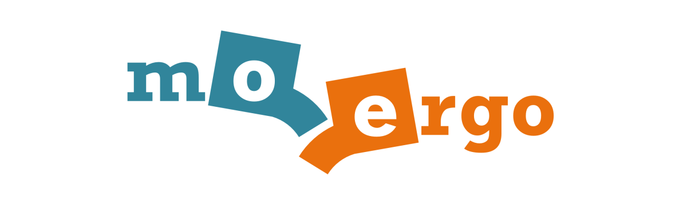

# Glove80 ZMK Config (personal fork)

A personal ZMK firmware configuration for the [MoErgo Glove80](https://www.moergo.com/) wireless split contoured keyboard.

This repo was originally forked from MoErgo's official template, [`moergo-sc/glove80-zmk-config`](https://github.com/moergo-sc/glove80-zmk-config) — full credit to MoErgo for the template, the Glove80 ZMK distribution ([`moergo-sc/zmk`](https://github.com/moergo-sc/zmk)), and the original `glove80.keymap`. Home-row-mod ideas are adapted from [Sunaku's Glove80 layout](https://sunaku.github.io/moergo-glove80-keyboard.html).

If you're looking for a clean starting template, **use the upstream repo, not this one** — fork [`moergo-sc/glove80-zmk-config`](https://github.com/moergo-sc/glove80-zmk-config) instead.

## What's in this fork

- **`config/glove80.keymap`** — the source of truth. Devicetree-format keymap with the layers and custom behaviors below.
- **`glove80.svg`** — auto-rendered visual of the current keymap. View it on [the GitHub page](./glove80.svg) for a per-layer breakdown.
- GitHub Actions for building firmware (`.github/workflows/build.yml`) and re-rendering the keymap drawing on PR (`.github/workflows/draw-keymaps.yml`).

### Layers

| #   | Name      | What it does                                                                                       |
| --- | --------- | -------------------------------------------------------------------------------------------------- |
| 0   | `Base`    | QWERTY with Miryoku-style home-row mods, linger-Q→qu, tap-dance caps-word, shift+space→underscore. |
| 1   | `Lower`   | Numpad, F-keys, media controls, layer-jumps.                                                       |
| 2   | `Cursor`  | Vim-ish nav cluster + Cmd-based clipboard / line-jump shortcuts (macOS).                           |
| 3   | `Spaces`  | OS workspace / virtual-desktop switching.                                                          |
| 4   | `Gaming`  | Plain QWERTY without home-row mods.                                                                |
| 5   | `LabVIEW` | LabVIEW-specific shortcuts.                                                                        |
| 6   | `Magic`   | System layer — Bluetooth profiles, RGB underglow, USB output, bootloader, sys-reset.               |

### Notable customizations vs. upstream default

- Miryoku-style home-row mods (`homey_*` for ALT/CTRL/GUI, `index_*` for SHIFT) tuned with a typing-streak guard to avoid accidental mod activation while typing fast.
- A "linger" tap-dance on Q that types `qu` when tapped quickly.
- Shift+Space (left-shift only) sends underscore.
- Tap-dances on the layer keys: tap = momentary, double-tap = sticky.
- A two-step magic key (hold for the system layer, tap for an RGB-underglow status indicator).

## Building & flashing

Builds run automatically on every push. To get a firmware UF2:

1. Push to this repo (or open a PR).
2. Open the [Actions tab](../../actions) → most recent **Build** run → **Artifacts** → download the `.uf2`.
3. Put each half of the Glove80 into bootloader mode (Magic + the bootloader key, or hold the bootloader chord while powering on — slow pulsing red LED confirms).
4. Copy the `.uf2` onto the mass-storage drive that appears. Repeat for the other half.

For full flashing details and the bootloader fallback procedure, see MoErgo's [Customizing key layout & loading firmware](https://docs.moergo.com/glove80-user-guide/customizing-key-layout/) guide.

## Resources

- [MoErgo Glove80 documentation](https://docs.moergo.com/) — official user guide
- [ZMK documentation](https://zmk.dev/docs) — firmware, behaviors, devicetree reference
- [`moergo-sc/zmk`](https://github.com/moergo-sc/zmk) — Glove80's ZMK distribution
- [keymap-drawer](https://github.com/caksoylar/keymap-drawer) — what generates `glove80.svg`

## License

MIT — see [LICENSE](LICENSE).
